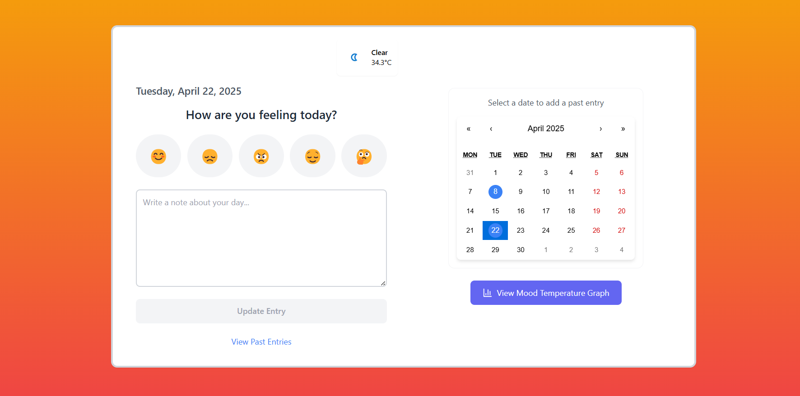

# MoodWeather

MoodWeather is a simple React application that allows users to track their moods and log entries. The app includes a mood selector, a page to display entries, a graph to visualize mood trends, and responsive design for both mobile and desktop views. The background color dynamically changes based on the user's selected mood. All entries are saved locally in the browser's local storage, ensuring that data persists even after a page refresh.

## Features

- **Mood Selector**: Users can select their current mood from a set of predefined moods, and the background color of the app changes accordingly.
- **Entries Page**: Displays a list of all mood entries made by the user.
- **Mood Graph**: A graph that visualizes mood trends over time.
- **Responsive Design**: The app is optimized for both mobile and desktop views.
- **Persistent Data**: Entries are stored in the browser's local storage to persist even after a page refresh.
- **Add Old Entries**: Users can add and view old mood entries from the past.

## Setup

### Prerequisites

- Node.js (version 16.x or higher)
- Yarn (optional, you can also use npm)



### Install Dependencies

To install the required dependencies, run:

```bash
yarn install


